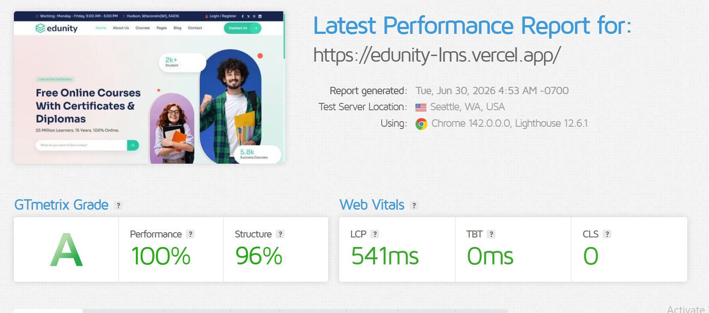

# 🎓 EDUNITY LMS

> A modern, SEO-optimized Learning Management System built with **Angular 21**, **Server-Side Rendering**, and a scalable **Domain-Driven Design** architecture.

[](https://angular.dev)
[](https://www.typescriptlang.org)
[](https://expressjs.com)
[](https://sass-lang.com)
[](https://vercel.com)

**🔗 Live Demo:** https://edunity-lms.vercel.app/

**👤 Author:** `Ahmed Hossam` · [LinkedIn](https://www.linkedin.com/in/ahmed-hossam-ab7114328) · [Portfolio](https://portfolio-self-theta-83.vercel.app/)

---

## 📖 Overview

EDUNITY is a front-end-focused LMS that delivers a smooth online learning experience: browsing courses, viewing instructor profiles, taking interactive quizzes, and tracking progress from a student dashboard.

The project was built to demonstrate **production-grade front-end engineering**: clean architecture, performance, SEO, accessibility, and maintainable code, not just a UI that looks good.

## ✨ Highlights

| Area | What was built |
| --- | --- |
| **Architecture** | Domain-Driven Design (`DDD`) with feature-based folders and barrel (`index.ts`) files for clean imports |
| **Performance** | Angular SSR + Express for fast first paint; benchmarked with GTmetrix (see below) |
| **SEO** | Server-rendered pages, dynamic sitemap generation with caching and pagination, `robots.txt` |
| **Scalability** | Separate `core`, `features`, `layout`, and `shared` layers with clear responsibilities |
| **Multi-environment** | Five build presets: local, test, development, UAT, live |
| **Deployment** | Vercel-ready with serverless API rewrites and SSR output |
| **UX** | Responsive across devices, with accessibility in mind |

## 🧩 Features

- 📚 **Course management**: browse and explore courses
- 👩‍🏫 **Instructor profiles**
- 📝 **Interactive quizzes**
- 📊 **Student dashboard and progress tracking**
- 🔐 **Authentication area**
- 📰 **Blogs, About, and Contact pages**
- 🌍 **i18n-ready core**, with SEO, logging, storage, toast notifications, and connectivity services
- 📱 **Responsive UI components**

## 🚀 Performance

The application was tested with **GTmetrix** to evaluate structure and Core Web Vitals.



## 🛠 Tech Stack

- **Framework:** Angular 21 (standalone components, built with `@angular/build:application`)
- **Rendering:** Angular SSR with entry point at `src/server.ts`
- **Server:** Express.js (`server/`)
- **Language:** TypeScript / Node.js
- **Styling:** SCSS design system (abstracts, base, components, themes)
- **Hosting:** Vercel

## 🏗 Architecture

The codebase follows a layered, feature-first structure:

```text
src/app/
├── core/       # Cross-cutting concerns: i18n, interceptors, SEO, routing,
│               # navigation, storage, logging, toast, connectivity, platform
├── features/   # Business domains: about, auth, blogs, contact,
│               # courses, home, not-found
├── layout/     # App shell: header, footer, sidebar + their configs/enums/interfaces
└── shared/     # Reusable utilities and components
```

Each feature is self-contained and follows the same internal convention:

```text
feature/
├── components/
├── configs/
├── constants/
├── enums/
├── interfaces/
├── pages/
├── routes/
└── index.ts      # barrel file, the feature's public API
```

<details>
<summary><b>📂 Full project structure</b></summary>

```text
EDUNITY-LMS/
├── api/                    # Serverless entry (Vercel)
│   └── index.js
├── public/                 # Static assets (favicon, robots, sitemaps)
├── server/                 # Express server
│   ├── core/               # fetch + sitemap cache services
│   ├── routes/             # sitemap routes
│   └── sitemap/            # generator, paginator, service
├── src/
│   ├── app/
│   │   ├── core/
│   │   ├── features/
│   │   ├── layout/
│   │   ├── shared/
│   │   ├── app.config.ts
│   │   ├── app.config.server.ts
│   │   ├── app.routes.ts
│   │   ├── app.routes.server.ts
│   │   └── prerender-routes-server.ts
│   ├── assets/             # fonts, images
│   ├── environments/       # local / test / dev / uat / live presets
│   ├── styles/             # SCSS design system
│   ├── main.ts
│   ├── main.server.ts
│   └── server.ts           # SSR entry
├── angular.json
├── package.json
├── tsconfig*.json
└── vercel.json
```

</details>

## ⚡ Getting Started

### Prerequisites

- [Node.js](https://nodejs.org) (LTS recommended)
- npm

### Installation

```bash
git clone <your-repo-url>
cd EDUNITY-LMS
npm install
```

### Run in development

```bash
npm start
```

Then open `http://localhost:4200`.

### Run tests

```bash
npm test
```

## 📦 Build & Run

### Standard builds

```bash
npm run build
npm run build:local
npm run build:test
npm run build:development
npm run build:uat
npm run build:live
```

### SSR builds

```bash
npm run build:ssr:local
npm run build:ssr:test
npm run build:ssr:development
npm run build:ssr:uat
npm run build:ssr:live
```

### Serve the SSR output

```bash
npm run serve:ssr
```

### Build and serve in one step

```bash
npm run ssr:local
npm run ssr:test
npm run ssr:development
npm run ssr:uat
npm run ssr:live
```

### Utilities

```bash
npm run watch        # build in watch mode
npm run clean:cache  # clear build cache/artifacts
```

## 🌍 Environments

Environment files are swapped automatically by Angular build configurations:

| Environment | File |
| --- | --- |
| Local | `src/environments/presets/environment.local.ts` |
| Test | `src/environments/presets/environment.test.ts` |
| Development | `src/environments/presets/environment.dev.ts` |
| UAT | `src/environments/presets/environment.uat.ts` |
| Live | `src/environments/presets/environment.live.ts` |

## 🌐 Server, API & SEO

- The Express server lives in `server/`.
- **Sitemap generation** (`server/sitemap/`) builds paginated sitemaps, with caching handled in `server/core/sitemap-cache.service.ts`.
- Static `robots.txt` and sitemap files are served from `public/`.

## ☁️ Deployment (Vercel)

Configured through `vercel.json`:

- Rewrites all `/api` requests to the project's `api` directory.
- Builds and deploys the SSR server output from `dist/edunity-lms/**`.

## 🎯 What This Project Demonstrates

- Building and structuring a **large-scale Angular application** with clear separation of concerns
- Implementing **SSR** for performance and SEO in a real deployment pipeline
- Writing **maintainable, modular, reusable** TypeScript code
- Working with **multiple environments** and CI/CD-style build configurations
- Designing a **responsive, accessible** user interface with a reusable SCSS design system
- Full-stack awareness: Express server, sitemap services, and serverless deployment


## 📬 Contact

I'm open to opportunities and happy to talk about this project.

- 📧 Email: `ahmedhossam66600@gmail.com`
- 💼 LinkedIn: `https://www.linkedin.com/in/ahmed-hossam-ab7114328`
- 🌐 Portfolio: `https://portfolio-self-theta-83.vercel.app/`
- 🐙 GitHub: `https://github.com/AhmedHossam555`

---

<p align="center">Built with ❤️ using Angular</p>